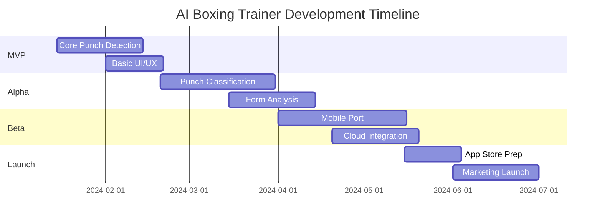

# AI Boxing trainer Plan 1

Status: Inbox
Favorite: No
Projects: AI Boxing Trainer (https://www.notion.so/AI-Boxing-Trainer-23caeb9631e280638a71e6468f4e11b3?pvs=21)

# AI Boxing Trainer: Technical Enhancement & Commercialization Report

## Executive Summary

Based on my analysis of your AI Boxing Trainer project, you've built a solid foundation using MediaPipe's pose estimation. The current multi-criteria punch detection logic (Phase 8) is a significant improvement over simple elbow angle detection. However, to transform this into a commercially viable product, we need to address core accuracy issues, expand functionality, and implement a robust deployment strategy across platforms.

## Current State Analysis

### Strengths

- Solid foundation with MediaPipe pose estimation
- Multi-criteria punch detection (guard position → punch → return)
- Real-time performance metrics (count & speed scoring)
- Clean, modular Python codebase

### Core Limitations

1. **Punch Type Differentiation**: Cannot distinguish between jabs, crosses, hooks, and uppercuts
2. **3D Spatial Awareness**: Limited depth perception using 2D pose estimation
3. **Form Analysis**: No technique feedback or correction guidance
4. **Environmental Sensitivity**: Performance varies with lighting and camera angles
5. **Platform Limitation**: Desktop-only implementation

## Technology Research & Integration Opportunities

### 1. Enhanced Pose Estimation Models

[**BlazePose GHUM 3D**](https://github.com/google/mediapipe/blob/master/docs/solutions/pose.md)

- Provides 3D landmark estimation with depth information
- Better for detecting punch trajectories in 3D space
- Already integrated with MediaPipe (minimal code changes)

[**MoveNet Thunder**](https://github.com/tensorflow/tfjs-models/tree/master/pose-detection)

- Google's state-of-the-art pose model
- 30% faster than BlazePose with comparable accuracy
- Better for mobile deployment

### 2. Action Recognition Models

[**MMAction2**](https://github.com/open-mmlab/mmaction2)

- Comprehensive action recognition toolkit
- Pre-trained models for sports actions
- Could be fine-tuned on boxing-specific datasets

[**SlowFast Networks**](https://github.com/facebookresearch/SlowFast)

- Excellent for detecting both quick punches and technique analysis
- Dual-pathway architecture perfect for boxing dynamics

### 3. Boxing-Specific Resources

[**AI Fitness Tracker**](https://github.com/arshren/AI-Fitness-Tracker)

- Similar project with rep counting logic
- Good reference for workout structuring

[**Pose Trainer**](https://github.com/stevenzchen/pose-trainer)

- Excellent form correction feedback system
- Could adapt their angle-based feedback mechanism

## Suggested Technical Improvements

### Phase 1: Enhanced Punch Classification System

```python
# Proposed punch classification architecture
class PunchClassifier:
    def __init__(self):
        self.trajectory_buffer = deque(maxlen=30)  # 1 second at 30fps
        self.punch_types = ['jab', 'cross', 'hook', 'uppercut']

    def classify_punch(self, landmarks_3d):
        # Extract key features
        wrist_trajectory = self.extract_trajectory(landmarks_3d)
        shoulder_rotation = self.calculate_shoulder_rotation(landmarks_3d)
        hip_engagement = self.calculate_hip_rotation(landmarks_3d)

        # Trajectory-based classification
        punch_vector = self.compute_punch_vector(wrist_trajectory)
        vertical_component = punch_vector[2] / np.linalg.norm(punch_vector)

        if vertical_component > 0.7:
            return 'uppercut'
        elif abs(punch_vector[0]) > abs(punch_vector[1]) * 1.5:
            return 'hook'
        elif self.is_lead_hand(landmarks_3d):
            return 'jab'
        else:
            return 'cross'

```

### Phase 2: Real-time Form Analysis

Implement a technique scoring system based on biomechanical principles:

```python
class FormAnalyzer:
    def __init__(self):
        self.ideal_angles = {
            'jab': {'shoulder': 45, 'hip': 15, 'elbow_extension': 175},
            'cross': {'shoulder': 90, 'hip': 45, 'elbow_extension': 178},
            'hook': {'shoulder': 90, 'hip': 30, 'elbow_angle': 90},
            'uppercut': {'shoulder': 75, 'hip': 25, 'elbow_angle': 45}
        }

    def analyze_form(self, punch_type, landmarks):
        score = 100
        feedback = []

        current_angles = self.calculate_angles(landmarks)
        ideal = self.ideal_angles[punch_type]

        for joint, ideal_angle in ideal.items():
            deviation = abs(current_angles[joint] - ideal_angle)
            if deviation > 15:
                score -= deviation * 0.5
                feedback.append(f"Adjust {joint}: {deviation}° off target")

        return score, feedback

```

### Phase 3: Advanced Features Implementation

1. **Combination Detection**: Track punch sequences (1-2, 1-2-3, etc.)
2. **Defensive Movement**: Detect slips, ducks, and weaves
3. **Footwork Analysis**: Monitor stance and movement patterns
4. **Fatigue Detection**: Track performance degradation over time

## Cross-Platform Development Strategy

### Recommended Tech Stack

1. **Core Engine**:
    - **TensorFlow.js** for web/mobile deployment
    - Shared C++ core with Python bindings for desktop
2. **Frontend Options**:
    - **Flutter** with platform channels for native performance
    - **React Native** with custom native modules
    - **Progressive Web App** for maximum reach
3. **Architecture Pattern**:

```
┌─────────────────────────────────────┐
│          Shared Core Logic          │
│  (TensorFlow Lite / MediaPipe)      │
└──────────────┬──────────────────────┘
               │
    ┌──────────┴──────────┐
    │                     │
┌───▼────┐         ┌──────▼──────┐
│Desktop │         │   Mobile    │
│(Python)│         │(Flutter/RN) │
└────────┘         └─────────────┘

```

### Implementation Roadmap



## Commercialization Strategy

### Monetization Model

**Freemium Tiered Approach:**

| Tier | Price | Features |
| --- | --- | --- |
| **Free** | $0 | • Basic punch counting<br>• 3 workouts/week<br>• Limited statistics |
| **Pro** | $9.99/mo | • All punch types<br>• Unlimited workouts<br>• Form analysis<br>• Progress tracking |
| **Coach** | $29.99/mo | • Everything in Pro<br>• Custom training plans<br>• Video export<br>• Priority support |
| **Gym License** | $199/mo | • Multi-user support<br>• Admin dashboard<br>• Custom branding<br>• API access |

### Revenue Projections

**Year 1 Targets:**

- 10,000 free users
- 5% conversion to Pro (500 users × $9.99 = $4,995/mo)
- 0.5% conversion to Coach (50 users × $29.99 = $1,499/mo)
- 10 gym licenses = $1,990/mo
- **Total MRR: $8,484** ($101,808 annually)

### Go-to-Market Strategy

1. **Phase 1: Community Building**
    - Launch on Product Hunt
    - Reddit engagement (r/amateur_boxing, r/fitness)
    - YouTube tutorials and demos
2. **Phase 2: Influencer Partnerships**
    - Partner with boxing coaches on Instagram/TikTok
    - Offer affiliate program (30% first month)
3. **Phase 3: B2B Expansion**
    - Target boutique fitness studios
    - Integrate with existing gym management software

## Immediate Action Items

1. **Week 1-2**: Implement 3D pose estimation with MediaPipe GHUM
2. **Week 3-4**: Build punch trajectory recording and classification
3. **Week 5-6**: Create form analysis feedback system
4. **Week 7-8**: Begin Flutter/React Native prototype
5. **Week 9-10**: Set up analytics and user testing framework

## Technical Resources

- **Dataset**: [KTH Actions Dataset](http://www.nada.kth.se/cvap/actions/) - Adapt for boxing movements
- **Research Paper**: ["Real-time Human Pose Estimation for Gesture Recognition"](https://arxiv.org/abs/2107.03143)
- **Similar Project**: [Pose Camera](https://github.com/google/pose-camera) - Good reference for mobile implementation
- **ML Framework**: [ML Kit Pose Detection](https://developers.google.com/ml-kit/vision/pose-detection) - For mobile optimization

## Conclusion

Your AI Boxing Trainer has strong commercial potential. The key to success lies in:

1. Improving accuracy through 3D pose estimation and trajectory analysis
2. Expanding functionality to cover all aspects of boxing training
3. Creating a seamless cross-platform experience
4. Building a community around the product

With focused development over the next 6 months, you can transform this prototype into a market-ready product generating significant recurring revenue.

Remember: **Ship early, iterate based on user feedback, and focus on solving real problems for boxing enthusiasts.**

---

*Ready to implement these improvements? Start with the 3D pose estimation upgrade - it's the foundation for everything else.*